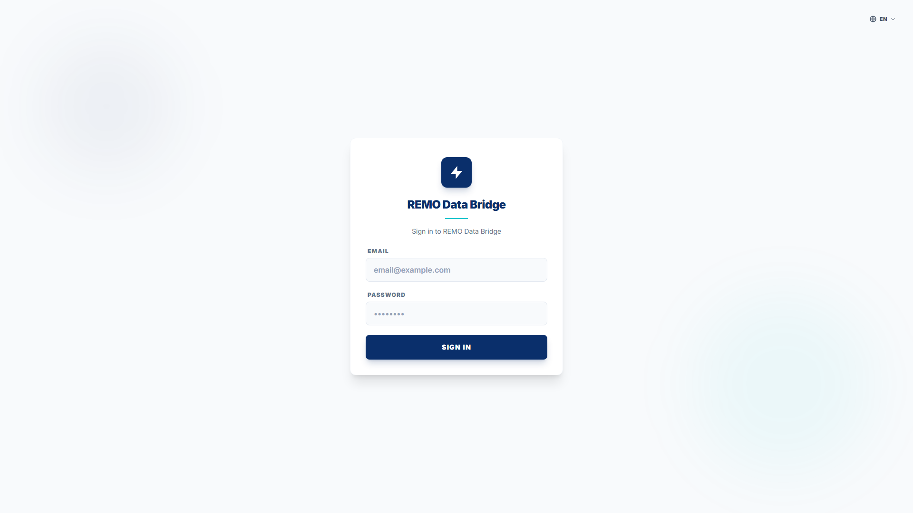

```
프로젝트의 사용자 매뉴얼을 자동으로 생성해줘. 아래 요구사항을 모두 수행해줘.

## 1. 환경 설정

### 패키지 설치
- playwright, @playwright/test, md-to-pdf, tsx 설치
- npx playwright install chromium 실행

### package.json 스크립트 추가
- "docs:screenshot": 스크린샷 캡처 스크립트
- "docs:pdf": PDF 생성 스크립트

### next.config 수정 (Next.js 프로젝트인 경우)
- devIndicators: false 추가하여 개발 도구 숨기기

## 2. 스크린샷 캡처 스크립트 작성 (scripts/capture-screenshots.ts)

### 기본 설정
- BASE_URL: [앱 URL 입력, 예: http://localhost:3000]
- 저장 위치: docs/screenshots/
- 뷰포트: 1920x1080
- 로케일: ko-KR

### 테스트 계정
- 이메일: [테스트 계정 이메일]
- 비밀번호: [테스트 계정 비밀번호]

### 캡처할 페이지 목록
1. 로그인 페이지 (/login) - 로그인 전
2. 대시보드 (/dashboard) - 로그인 후
3. [추가 페이지들...]

### 특수 처리
- 팝업/모달이 있는 경우: 팝업 스크린샷과 팝업 확인 후 스크린샷 별도 캡처
- 동적 라우트(/items/[id]): 목록에서 첫 번째 항목 클릭하여 상세 페이지 캡처
- Next.js 개발 도구 숨김 CSS 주입

## 3. PDF 생성 스크립트 작성 (scripts/generate-pdf.ts)

### 생성할 PDF
- USER_MANUAL_KO.pdf (한국어)
- USER_MANUAL_EN.pdf (영어)
- USER_MANUAL_TH.pdf (태국어) [필요시]

### PDF 스타일
- A4 사이즈, 여백 20mm/15mm
- 각 챕터(h2) 새 페이지에서 시작 (단, 목차와 1챕터는 같은 페이지)
- 이미지에 테두리와 그림자 효과

## 4. 매뉴얼 마크다운 작성 (docs/USER_MANUAL.md, USER_MANUAL_EN.md, USER_MANUAL_TH.md)

### 문서 구조
```markdown
# [프로젝트명] 사용자 매뉴얼

**버전:** 1.0
**최종 수정일:** [현재 날짜]

---

## 목차
1. [사이트 접속](#1-사이트-접속)
2. [로그인](#2-로그인)
3. [기능1](#3-기능1)
...

---

## 1. 사이트 접속

### 접속 URL
**[사이트 URL]**

### 접속 방법
1. 웹 브라우저를 실행합니다.
2. 주소창에 URL을 입력합니다.
3. Enter 키를 눌러 접속합니다.

### 권장 브라우저
- Google Chrome (최신 버전)
- Microsoft Edge (최신 버전)
- Safari (최신 버전)

---

## 2. 로그인



### 설명
- [페이지 설명]

### 사용 방법
1. [단계별 설명]

### 계정 생성
- 계정이 없는 경우 [담당자/이메일]로 요청
```

### 각 섹션 포함 내용
- 스크린샷 이미지
- 페이지 설명
- 사용 방법 (단계별)
- 주요 기능 목록

### 페이지 나누기
- 특정 섹션에서 새 페이지 시작이 필요하면: `<div style="page-break-before: always;"></div>`

## 5. 실행

1. 앱 실행 확인 (npm run dev)
2. 스크린샷 캡처: npm run docs:screenshot
3. PDF 생성: npm run docs:pdf

## 6. 결과물

- docs/screenshots/*.png (스크린샷)
- docs/USER_MANUAL.md (한국어 마크다운)
- docs/USER_MANUAL_EN.md (영어 마크다운)
- docs/USER_MANUAL_TH.md (태국어 마크다운)
- docs/USER_MANUAL_KO.pdf (한국어 PDF)
- docs/USER_MANUAL_EN.pdf (영어 PDF)
- docs/USER_MANUAL_TH.pdf (태국어 PDF)
```

---

## 프롬프트 사용 예시

```
프로젝트의 사용자 매뉴얼을 자동으로 생성해줘.

## 1. 환경 설정
- Next.js 프로젝트
- 앱 URL: http://localhost:3000

## 2. 스크린샷 캡처
- 테스트 계정: admin@example.com / password123
- 캡처할 페이지:
  1. 로그인 (/login)
  2. 대시보드 (/dashboard)
  3. 사용자 목록 (/users)
  4. 사용자 등록 (/users/new)
  5. 설정 (/settings)

## 3. 매뉴얼 정보
- 프로젝트명: My Admin System
- 사이트 URL: https://admin.example.com
- 계정 생성 문의: support@example.com
- 언어: 한국어, 영어

## 4. 실행
- 스크린샷 캡처 후 PDF까지 생성해줘
```

---

## 커스터마이징 옵션

### 뷰포트 크기 변경
```
뷰포트를 1440x900으로 설정해줘
```

### 특정 언어만 생성
```
한국어와 영어 매뉴얼만 생성해줘
```

### 페이지 추가
```
/reports 페이지도 캡처해서 매뉴얼에 추가해줘
```

### 스타일 변경
```
PDF 헤더에 회사 로고 텍스트 추가해줘
PDF 푸터에 페이지 번호 추가해줘
```

---

## 매뉴얼 업데이트 명령어

```bash
# 스크린샷만 다시 캡처
npm run docs:screenshot

# PDF만 다시 생성
npm run docs:pdf

# 전체 재생성
npm run docs:screenshot && npm run docs:pdf
```
