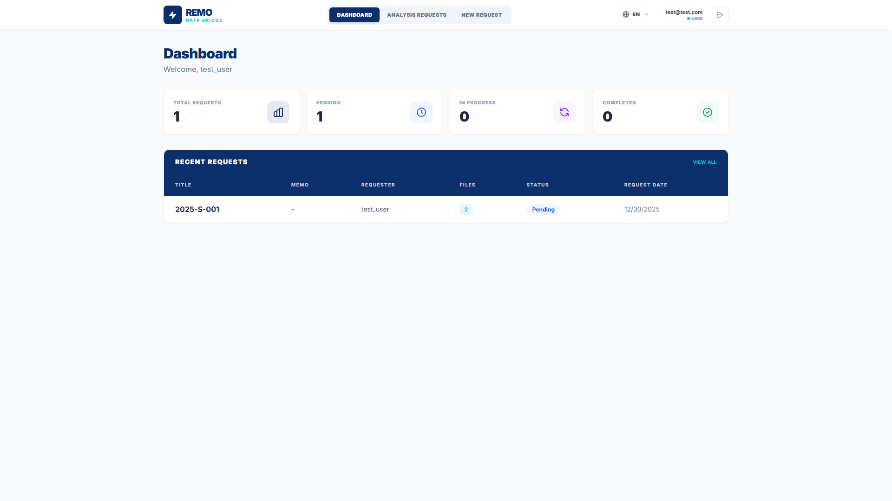
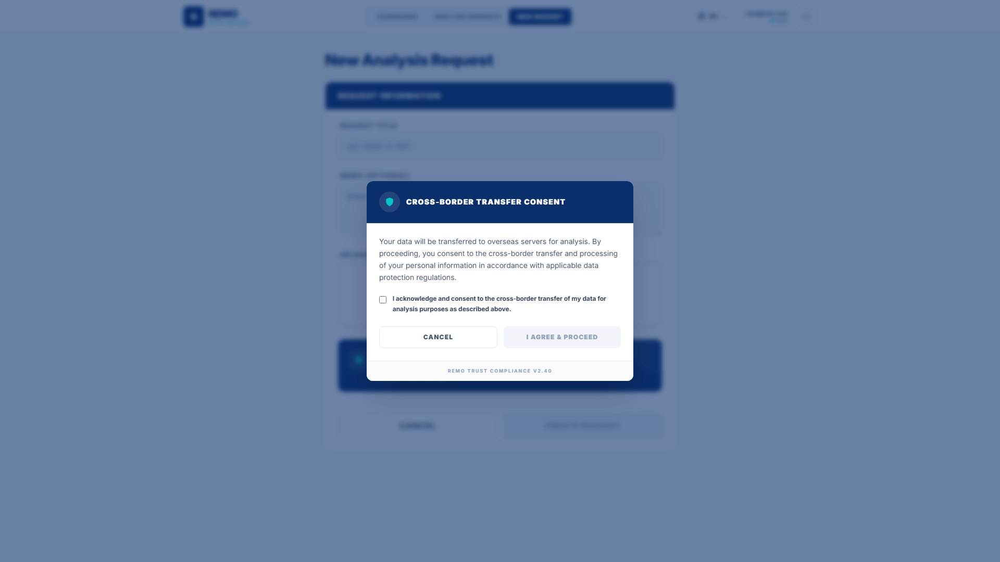
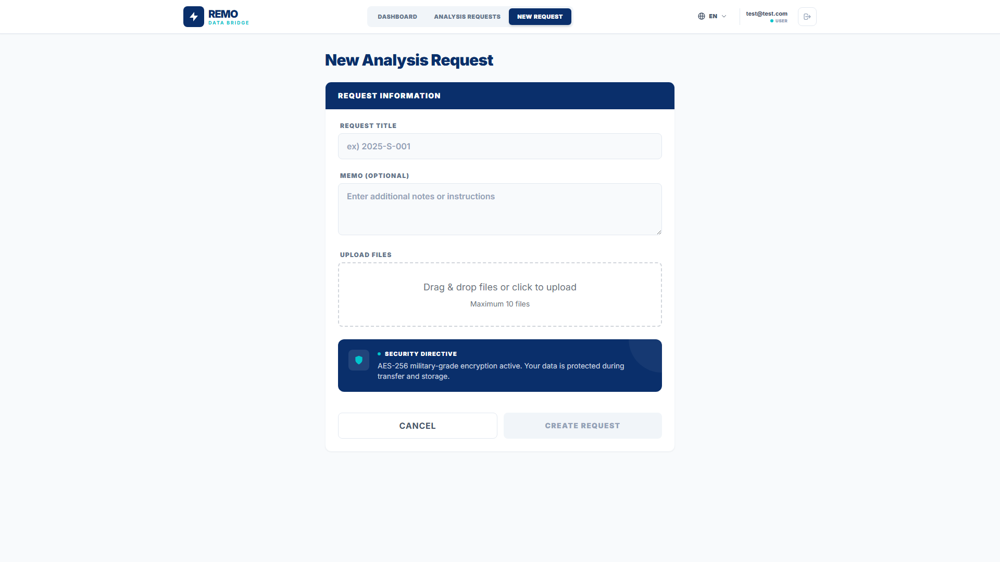
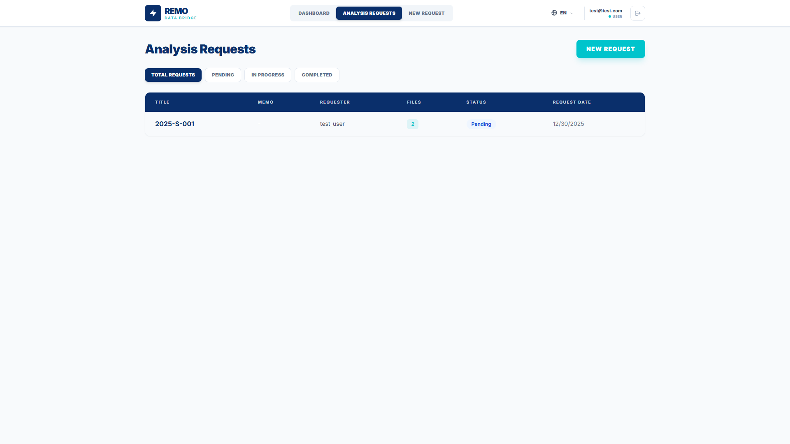

# Remo Data Bridge User Manual

**Version:** 1.0
**Last Updated:** 2025-12-30

---

## Table of Contents
1. [Accessing the Site](#1-accessing-the-site)
2. [Login](#2-login)
3. [Dashboard](#3-dashboard)
4. [Request List](#4-request-list)
5. [Create New Request](#5-create-new-request)
6. [Request Detail](#6-request-detail)

---

## 1. Accessing the Site

### Access URL
**http://remo-data-bridge.remo.re.kr:3015/**

### How to Access
1. Open a web browser (Chrome, Edge, Safari, etc.).
2. Enter the URL above in the address bar.
3. Press Enter to access the site.

### Recommended Browsers
- Google Chrome (latest version)
- Microsoft Edge (latest version)
- Safari (latest version)

---

## 2. Login

### Description
- This is the login page for accessing the system.
- Enter your email and password to log in.

### How to Use
1. Enter your email address.
2. Enter your password.
3. Click the **Login** button.

### Account Creation
- If you do not have an account, you must request account creation from REMO.
- Account creation request: **info@remo.re.kr**

---

## 3. Dashboard

### Description
- This is the main screen displayed after logging in.
- You can view the overall request status at a glance.

### Key Features
- View statistics by request status
- View recent request list
- Quick action menu

---

## 4. Request List

### Description
- View all registered analysis requests in a list.

### Key Features
- Search and filter requests
- Check request status (Pending, In Progress, Completed)
- Navigate to request detail page
- Create new request

---

## 5. Create New Request

### 5-1. Data Transfer Consent

### Description
- When creating a new request, a **Cross-Border Data Transfer Consent** popup is displayed first.
- User consent is required as data will be transferred to overseas servers for analysis.

### How to Use
1. Review the consent information.
2. Click the consent checkbox at the bottom.
3. Click the **Agree & Proceed** button.
4. To decline, click the **Cancel** button to return to the previous page.

---

### 5-2. Enter Request Information

### Description
- This is the form for creating an analysis request after consent.

### How to Use
1. Enter the **Request Title**.
2. **Upload files** required for analysis.
3. Add a **Memo** if you have additional notes.
4. Click the **Submit Request** button.

### File Upload
- You can upload files by drag and drop.
- Multiple files can be uploaded at once.
- Uploaded files are securely transferred with AES-256 encryption.

---

## 6. Request Detail

### Description
- This page displays detailed information about an individual analysis request.

### Key Features
- View request information (title, status, creation date, etc.)
- View uploaded file list and download
- Check analysis results
- Download result files

### File Download
- Click on a filename to download the file.

---

*This document includes auto-generated screenshots.*
